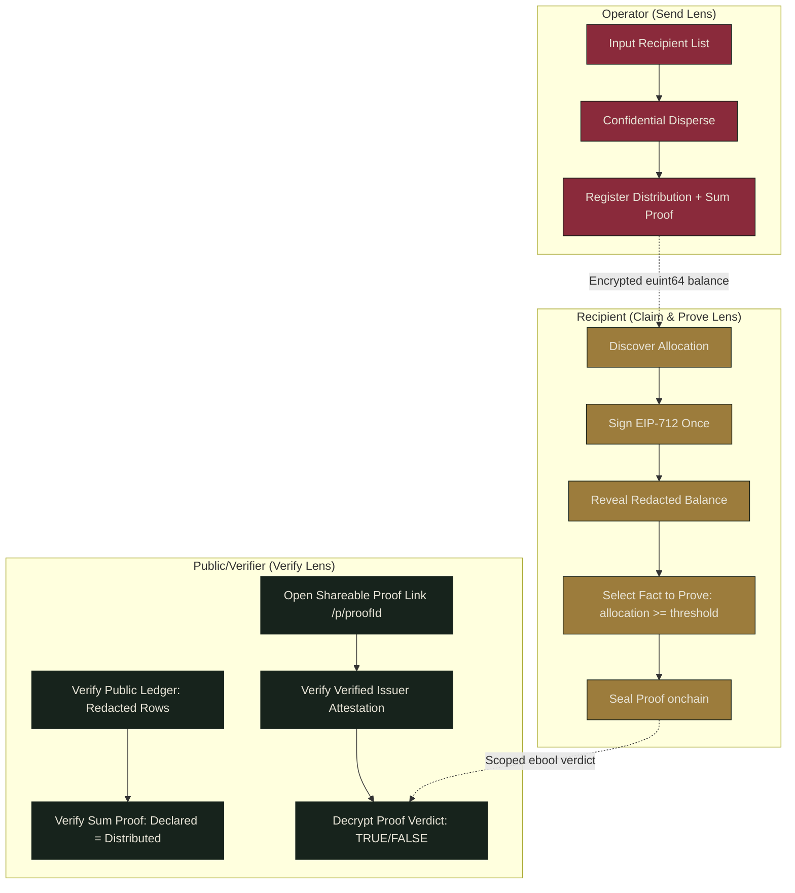
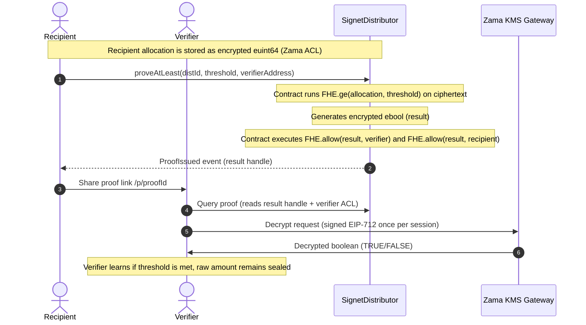

# Signet

**Prove you were paid. Never show how much.**

Signet is a confidential token-distribution dApp on the [Zama Protocol](https://www.zama.ai) (FHEVM). An operator pays many recipients at once through the [TokenOps SDK](https://www.npmjs.com/package/@tokenops/sdk)'s confidential disperse — amounts encrypted onchain as ERC-7984 `euint64`s — and every payout leaves each recipient a **portable proof-of-receipt**: a credential they can use to prove facts about their allocation (*"paid by a verified fund"*, *"at least $2,000"*) to any third party **without ever revealing the amount**.

Built for the **Zama Developer Program · Season 3 · Special Bounty Track × TokenOps**. Deployed on Sepolia.

> **Live demo:** https://signet-app-two.vercel.app — wallet-free walkthrough at [`/app?demo=true`](https://signet-app-two.vercel.app/app?demo=true), and a real onchain proof a stranger can verify at [`/p/0`](https://signet-app-two.vercel.app/p/0).
>
> **Live proof it's real:** every claim below is backed by onchain transactions — see [SUBMISSION-ARTIFACTS.md](SUBMISSION-ARTIFACTS.md) for the deployed contracts, a real confidential disperse, and a real selective-disclosure proof.

---

## The thesis

Everyone building on a confidential-payments SDK ships the same thing: a sealed group payment. That's a commodity — the SDK's stock function. Signet keeps the payment as boring plumbing and builds the product on top of what the payment *leaves behind*:

**After you're paid, you hold a receipt you can prove things with.**

A borderless worker gets paid by a DAO or fund in confidential stablecoins. Later they need to *prove* that income — for a loan, a visa, a rental, a grant. Today they either hand a stranger their exact bank statement (exposed, permanently) or point at an onchain record (public, forever). Signet answers *"were you paid at least X by a verified party?"* with a cryptographically trustworthy **yes** while the exact number stays sealed.

## Three lenses, one dataset

The whole UI is one surface viewed through three lenses — same onchain data, three different truths:

| lens | who | what they see |
|---|---|---|
| **Send** | operator | full roster; paste addresses + amounts, one confidential disperse |
| **Claim** | recipient | only their own slice — one EIP-712 signature lifts the redaction bar; then **Prove**: mint a selective-disclosure proof to any verifier |
| **Verify** | public | the aggregate: N recipients, *declared total = distributed total* proven under encryption, every individual row redacted |



A wallet-free **demo mode** (`/app?demo=true`) reproduces the full flow on mocked data through the *same components* — no parallel UI.

## How the selective disclosure works (the differentiator)

The amount sits in a sealed box (an encrypted `euint64` under the Zama ACL). Most confidential apps only let you open your own box to peek. Signet lets you **ask a question of the box without opening it** — and hand the yes/no to whoever's asking:



1. Your allocation is the disperse's own encrypted handle. Only you (and the operator, who chose the amount) hold decryption rights.
2. To prove "≥ $2,000", `SignetDistributor.proveAtLeast` computes `FHE.ge(allocation, threshold)` **on the ciphertext**, producing an encrypted boolean.
3. The verifier is granted decryption rights to **only that boolean**. They read one `TRUE`. The raw amount is never in their reach — enforced by the FHEVM ACL, not by frontend politeness.
4. The proof carries the fund's onchain attestation (issuer registry), so it can't be minted by an impostor — the anti-forgery a PDF receipt lacks.

Anyone opening a shared `/p/<proofId>` link sees every fact **read live from the chain**: the threshold, the issuer's verified status (resolved `proofId → distId → verifiedIssuer`), and a provenance check that the receipt handle appears verbatim in the disperse transaction — nothing is taken on the sharer's word.


## Architecture — two layers, kept separate

### Layer 1 · Settlement (the TokenOps SDK, not reinvented)

`SignetToken` (ERC-7984, via `@openzeppelin/confidential-contracts`) is dispersed through the TokenOps `DisperseConfidential` singleton (direct mode) using `@tokenops/sdk` — amounts encrypted client-side, one transaction, per-recipient encrypted balances.

### Layer 2 · Receipt & proof (`SignetDistributor` — Signet's addition)

The key design decision: **proofs run directly on the disperse's own `requested` handles** — no duplicate encrypted copy is ever created. The verified TokenOps contract leaves each per-recipient handle ACL'd to `{singleton, sender, recipient}`, and its `batchDiscloseHandlesToParty` grants our distributor permanent *compute* rights on exactly those handles.

The full Send flow is three transactions for any batch (≤ 20 recipients):

```
1. tokenops.disperse({ token, mode: "direct", recipients, amounts })   ← settlement
2. singleton.batchDiscloseHandlesToParty(requestedHandles, distributor) ← compute ACL
3. distributor.registerDistribution(declaredTotal, disperseTxHash,
                                    recipients, handles)                ← receipts + sum-proof
```

**Trust model of the attach step** — the handle↔recipient mapping is *not* the operator's say-so:

- **Onchain:** `registerDistribution` reverts unless each handle is ACL'd to the distributor (the disclosure happened) *and* to its claimed recipient — which kills recipient-swap attacks outright, since the disperse granted handle *i* to recipient *i* only.
- **Offchain:** the stored `disperseTxHash` binds the registration to the disperse transaction; the Verify view and every `/p/` page re-derive the roster from that transaction's own event and cross-check it against contract state.
- **Settlement integrity (fail loudly):** before registering anything, the operator flow decrypts every `transferred` handle and aborts if any recipient received less than requested — so proofs (which attest to the *allocated* amount) can never diverge from what actually moved.

The public **sum-proof**: registration folds `FHE.add` over the encrypted handles and publishes `FHE.eq(sum, declaredTotal)` as a *publicly decryptable* boolean — anyone can verify the fund paid out exactly what it declared, without seeing a single row.

### Honest scope (verified, not hand-waved)

- **Amounts are confidential. Recipient addresses are not.** ACL grants are public transactions; membership is enumerable from events. Signet does **not** claim a hidden recipient list.
- Proofs attest to the **requested (allocated)** amount; the settlement-integrity guard makes allocated = settled an enforced invariant within Signet.
- The operator can decrypt allocations they dispersed (they chose the amounts — inherent, not a leak).
- Demo mode is mocked and clearly labeled; the real path is Sepolia, and [SUBMISSION-ARTIFACTS.md](SUBMISSION-ARTIFACTS.md) is the receipts.

## Repository layout

```
packages/
  contracts/           Hardhat + @fhevm/solidity + @openzeppelin/confidential-contracts
    contracts/
      SignetToken.sol        ERC-7984 confidential token (settlement asset)
      SignetDistributor.sol  receipts, verified attach, proveAtLeast, sum-proof
      LocalDisperse.sol      grant-faithful local double of the TokenOps singleton
    test/                    23 tests: proof path, ACL isolation, attach guards, sum-proof
    scripts/
      deploy-local.ts        local node deploy + ABI/address export to the app
      deploy-sepolia.ts      owner-run, gated to chainId 11155111
      sepolia-roundtrip.mjs  end-to-end proof against the REAL relayer/KMS
      smoke-local.mjs        the app's exact client plumbing vs a local node
      fund-recipient.mjs     tops up a recipient wallet with gas ETH
  app/                 Next.js (App Router) + TypeScript + Tailwind + wagmi/viem
    src/app/                 / (landing) · /app (three lenses) · /p/[proofId] (verifier view)
    src/lib/disperse.ts      the 3-tx Send orchestration + settlement guard
    src/lib/fhevm/           chain-branched FHE client + EIP-712 session cache
    scripts/build-zama-web.mjs  self-hosts the Zama relayer web bundle (prebuild)
RUNBOOK-SEPOLIA.md     owner-run deploy + round-trip, step by step
SUBMISSION-ARTIFACTS.md  the real Sepolia transactions backing every claim
```

## Quickstart (local, no keys needed)

Prereqs: Node ≥ 20, npm ≥ 10.

```bash
npm install --legacy-peer-deps          # tokenops sdk peers on wagmi v2; we use its viem client only

# terminal 1 — local FHEVM mock node
npm run node:local --workspace @signet/contracts

# terminal 2 — deploy + wire addresses/ABIs into the app
npm run deploy:local --workspace @signet/contracts

# run the tests (23) and the end-to-end smoke
npm run test --workspace @signet/contracts
node packages/contracts/scripts/smoke-local.mjs

# the app
npm run build --workspace @signet/app
npm run start --workspace @signet/app   # http://localhost:3000
```

Open `http://localhost:3000/app?demo=true` for the wallet-free demo, or connect MetaMask to `localhost:8545` (import a hardhat dev key) for the real local flow. Send is prefilled with hardhat accounts.

## Sepolia

Contracts are live — addresses in [SUBMISSION-ARTIFACTS.md](SUBMISSION-ARTIFACTS.md) and `packages/app/src/lib/chain/gen/deployments.sepolia.json`. To redeploy or reproduce the round-trip yourself: copy `.env.example` → `.env` (repo root, gitignored — the only place secrets ever live), fill in your keys, and follow [RUNBOOK-SEPOLIA.md](RUNBOOK-SEPOLIA.md). Every script hard-gates on chainId 11155111 and refuses mainnet URLs.

The Sepolia decrypt UX is honest about physics: real KMS user-decryptions take ~10–15s, and the UI says so while it works. The EIP-712 decryption session is signed **once per session** and cached — no repeated wallet popups, ever.

## Engineering notes (the non-obvious bits)

- **One FHE client interface, two backends.** Locally, `@fhevm/mock-utils` builds a `MockFhevmInstance` from the hardhat node's `fhevm_relayer_metadata` RPC (its heavyweight relayer-SDK import is aliased to a ~150-line pure-JS shim, validated byte-for-byte against the real verifier). On Sepolia, the real `@zama-fhe/relayer-sdk` web build is **self-hosted**: pre-bundled by esbuild into `public/zama/` at `prebuild` and dynamic-imported at runtime, because Zama's CDN no longer serves 0.4.x and the WASM/worker graph breaks Next's bundlers.
- **No unbounded `getLogs`.** Real RPCs reject block-range scans from 0. Claim discovers allocations by direct `hasAllocation` reads; Verify derives the roster from the disperse transaction's receipt (single lookup by hash) and cross-checks against `allocationOf` state.
- **The TokenOps ACL reconnaissance** that shaped the architecture (which handles are disclosable, to whom, and why `transferred` handles aren't) came from reading the verified `DisperseConfidential` source — the write-up lives in the git history of this repo's milestone reports.
- **Wallets:** every EIP-6963 injected provider is enumerated and the user picks — no auto-select.

## Bounty compliance checklist

- ✅ Settlement via `@tokenops/sdk` (confidential disperse, direct mode) — the SDK is the only settlement path on Sepolia
- ✅ ERC-7984 confidential token (`@openzeppelin/confidential-contracts`)
- ✅ Deployed on Sepolia; smart contracts + frontend both implemented
- ✅ Recipients verify + decrypt their own allocation (one EIP-712 signature, session-cached)
- ✅ Amounts remain confidential onchain; recipient list honestly disclosed as public
- ✅ No "Zama" in the project name

## License

BSD-3-Clause-Clear (matching the FHEVM ecosystem).
